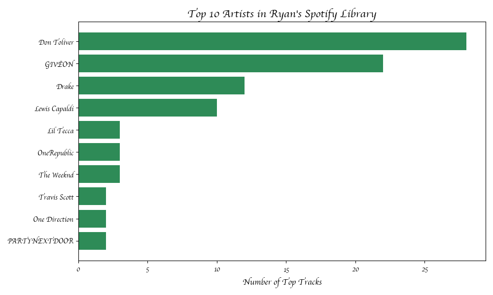
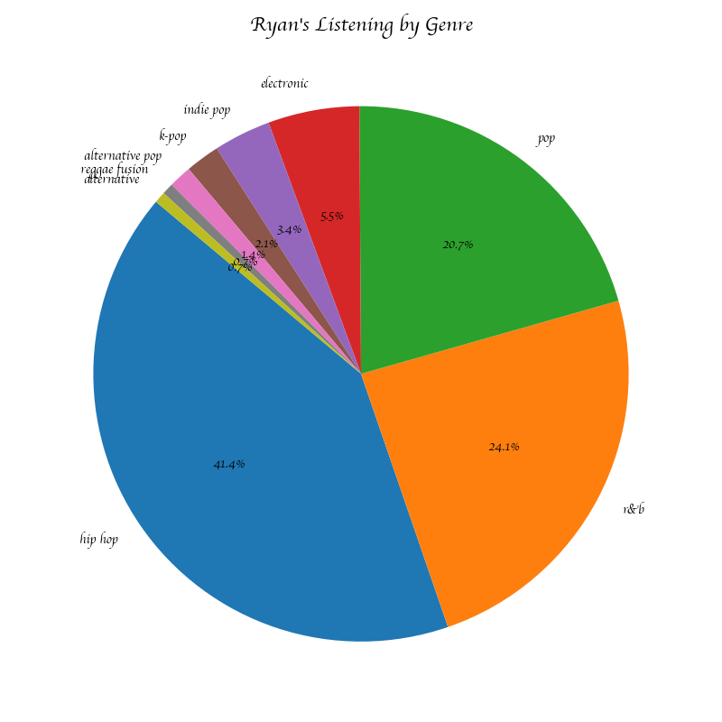

# Spotify Listening Analysis 🎵

A personal data science project that uses the Spotify Web API to analyze my listening habits — exploring my top tracks, favorite artists, and genre breakdown across different time periods.

## What it does
- Fetches my top 50 tracks across short, medium, and long term time windows
- Identifies recent obsessions vs long term favorites
- Visualizes my top 10 most repeated artists
- Breaks down my listening by genre

## Charts

## Tech used
- Python
- Spotipy
- Pandas
- Matplotlib

## How to run it
1. Clone the repo
2. Install dependencies: `pip install spotipy pandas matplotlib python-dotenv`
3. Create a Spotify Developer app at developer.spotify.com
4. Add your credentials to a `.env` file:
5. Run `fetch_data.py` to pull your data
6. Run `visualize.py` to generate the charts
